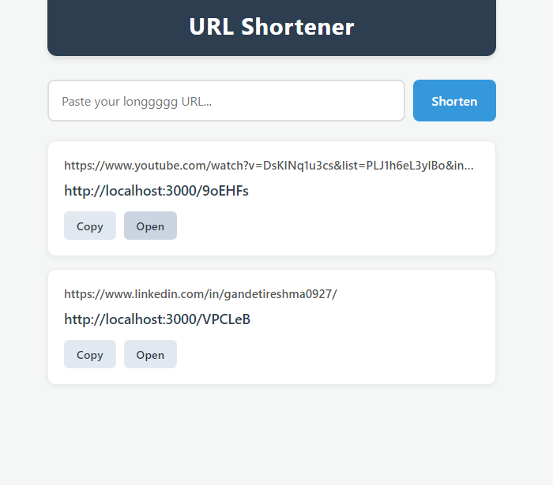
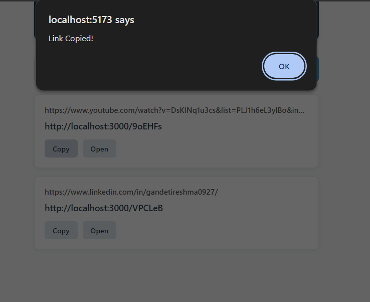

# URL Shortener (MERN Stack)

A modern full-stack URL Shortener application built using the MERN Stack. This application allows users to convert long URLs into short, shareable links with a clean and responsive user interface. Each shortened link redirects users to the original destination while tracking the total number of visits.

### Live Demo

**Frontend:** `Add Frontend Live Link`

**Backend API:** `Add Backend Live Link`

---

## Preview

### Home Page



---

### Shortened URLs



---

## Features

- Generate short URLs from long URLs
- Automatic unique short code generation
- Redirect shortened URLs to the original website
- Track click count for every shortened URL
- Copy shortened URLs to clipboard
- Responsive user interface
- RESTful API architecture
- MongoDB database integration

---

## Tech Stack

### Frontend

- React.js
- CSS3
- Fetch API

### Backend

- Node.js
- Express.js

### Database

- MongoDB
- Mongoose

---

## Project Structure

```text
URL-Shortener/

├── client/
│   ├── src/
│   │   ├── components/
│   │   ├── services/
│   │   ├── App.jsx
│   │   └── main.jsx
│   └── package.json
│
├── server/
│   ├── config/
│   ├── controllers/│
│   ├── models/
│   ├── routes/
│   ├── index.js
│   └── package.json
│
└── README.md
```

---

## API Endpoints

### Create Short URL

| Method | Endpoint |
|--------|----------|
| POST | `/shorten` |

---

### Redirect URL

| Method | Endpoint |
|--------|----------|
| GET | `/:shortCode` |

---

## Installation

### Clone Repository

```bash
git clone https://github.com/Reshma0927/url-shortener.git
```

---

### Backend Setup

```bash
cd server
npm install
```

Create a `.env` file

```env
PORT=3000
MONGO_URI=Your_MongoDB_URI
```

Start the backend

```bash
npm run dev
```

---

### Frontend Setup

```bash
cd client
npm install
npm run dev
```

---

## How It Works

1. User enters a long URL.
2. The backend generates a unique short code.
3. The URL and short code are stored in MongoDB.
4. A shortened URL is returned to the user.
5. Visiting the shortened URL redirects to the original website.
6. Every visit increments the click count.

---

## Future Improvements

- User Authentication
- User-specific URL Management
- Custom Short URLs
- QR Code Generation
- URL Expiration
- Analytics Dashboard
- Search and Filter URLs
- Dark Mode
- Edit and Delete Shortened URLs

---

## Learning Outcomes

This project helped strengthen practical knowledge of:

- React Components
- State Management
- REST APIs
- Express Routing
- MongoDB CRUD Operations
- Mongoose Models
- URL Redirection
- Fetch API
- Full Stack Application Development
- MERN Project Deployment

---

## Author

**Reshma Gandeti**

GitHub: https://github.com/Reshma0927

LinkedIn: https://www.linkedin.com/in/gandetireshma0927/
